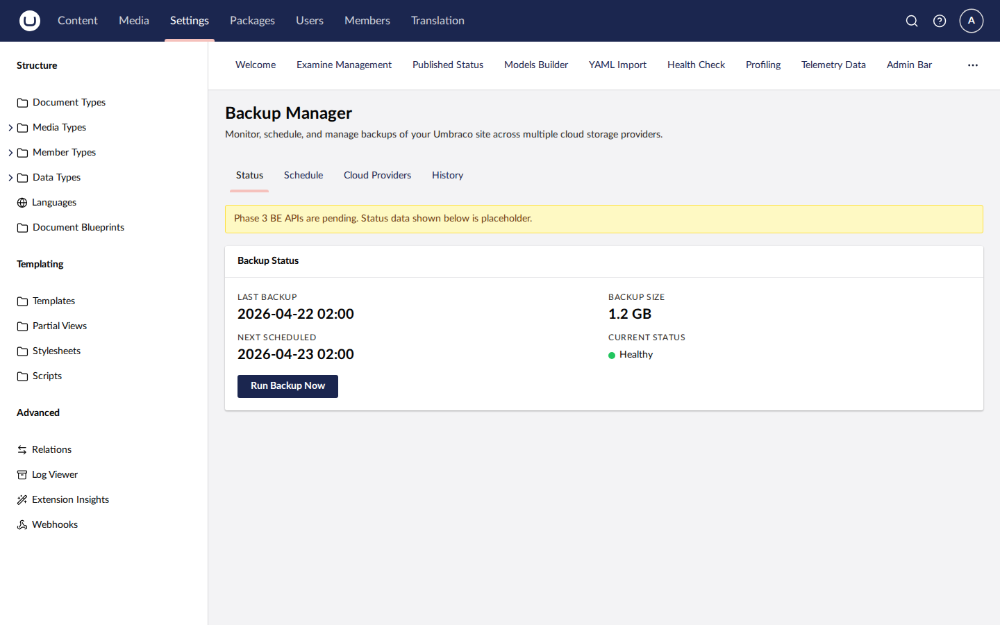

# BackupManager

Umbraco backoffice dashboard for scheduling, triggering, and uploading backups to cloud storage providers. Supports Umbraco 13 (net8.0) and Umbraco 17 (net10.0).

[](https://www.nuget.org/packages/SplatDev.Plugins.BackupVault)

## Features

- On-demand and scheduled database + file backups from the Umbraco backoffice
- Upload backups directly to cloud storage — no server access required
- Pluggable storage provider architecture (`IBackupStorageProvider`)

## Supported cloud providers

| Provider            | Status |
|---------------------|--------|
| Local file system   | ✅ Built-in |
| AWS S3              | ✅ |
| Azure Blob Storage  | ✅ |
| Google Cloud Storage| ✅ |
| Dropbox             | ✅ |
| OneDrive            | ✅ |
| Box                 | ✅ |
| PrismDrive          | ✅ |

## Compatibility

| Umbraco | .NET | Package Version |
|---------|------|-----------------|
| 13.x    | 8.0  | 2.0.0           |
| 17.x    | 10.0 | 2.0.0           |

## Installation

```sh
dotnet add package SplatDev.Plugins.BackupVault
```

## Quick Start

Register in `Program.cs`:

```csharp
builder.CreateUmbracoBuilder()
    .AddBackOffice()
    .AddWebsite()
    .AddBackupManager()   // <-- add this
    .Build();
```

## Configuration

Add provider credentials to `appsettings.json`:

```json
{
  "BackupManager": {
    "Provider": "AwsS3",
    "AwsS3": {
      "BucketName": "my-umbraco-backups",
      "Region": "us-east-1",
      "AccessKeyId": "",
      "SecretAccessKey": ""
    }
  }
}
```


## Dashboard


## License

MIT © [SplatDev](https://github.com/SplatDev-Ltda)
