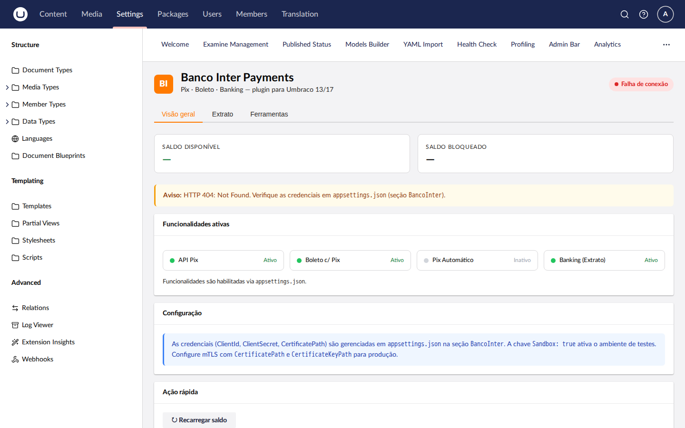

# Payments.BancoInter

Banco Inter payment integration for Umbraco. Supports Pix (immediate and due charges), Boleto com Pix, Banking (outbound Pix, boleto payments, balance/statement), and webhook handling. Supports Umbraco 13 (net8.0) and Umbraco 17 (net10.0).

[](https://www.nuget.org/packages/SplatDev.Umbraco.Plugins.Payments.BancoInter)

## Compatibility

| Umbraco | .NET | Package Version |
|---------|------|-----------------|
| 13.x    | 8.0  | 2.0.0           |
| 17.x    | 10.0 | 2.0.0           |

## Installation

```sh
dotnet add package SplatDev.Umbraco.Plugins.Payments.BancoInter
```

## Quick Start

Register in `Program.cs`:

```csharp
builder.CreateUmbracoBuilder()
    .AddBackOffice()
    .AddWebsite()
    .AddBancoInter()   // <-- add this
    .Build();
```

## Configuration

Add to `appsettings.json`:

```json
{
  "BancoInter": {
    "ClientId": "",
    "ClientSecret": "",
    "CertificatePath": "",
    "CertificatePassword": "",
    "Environment": "sandbox"
  }
}
```


## Dashboard


## License

MIT © [SplatDev](https://github.com/SplatDev-Ltda)
