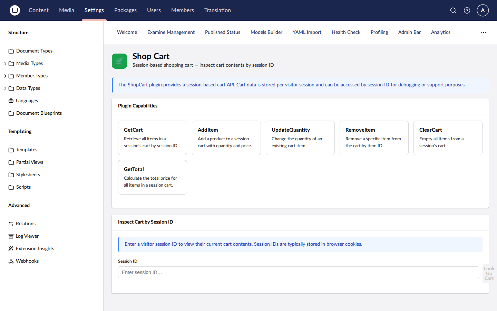

# ShopCart

Simple shopping cart for Umbraco — add/remove items, checkout flow with session-based cart management. Supports Umbraco 13 (net8.0) and Umbraco 17 (net10.0).

[](https://www.nuget.org/packages/SplatDev.Umbraco.Plugins.ShopCart)

## Compatibility

| Umbraco | .NET | Package Version |
|---------|------|-----------------|
| 13.x    | 8.0  | 2.0.0           |
| 17.x    | 10.0 | 2.0.0           |

## Installation

```sh
dotnet add package SplatDev.Umbraco.Plugins.ShopCart
```

## Quick Start

Register in `Program.cs`:

```csharp
builder.CreateUmbracoBuilder()
    .AddBackOffice()
    .AddWebsite()
    .AddShopCart()   // <-- add this
    .Build();
```


## Dashboard


## License

MIT © [SplatDev](https://github.com/SplatDev-Ltda)
