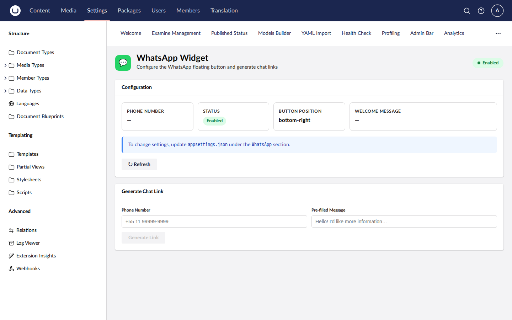

# WhatsApp

Floating WhatsApp chat button for Umbraco — one-click WhatsApp chat initiation with configurable settings. Supports Umbraco 13 (net8.0) and Umbraco 17 (net10.0).

[](https://www.nuget.org/packages/SplatDev.Umbraco.Plugins.WhatsApp)

## Compatibility

| Umbraco | .NET | Package Version |
|---------|------|-----------------|
| 13.x    | 8.0  | 2.0.0           |
| 17.x    | 10.0 | 2.0.0           |

## Installation

```sh
dotnet add package SplatDev.Umbraco.Plugins.WhatsApp
```

## Quick Start

Register in `Program.cs`:

```csharp
builder.CreateUmbracoBuilder()
    .AddBackOffice()
    .AddWebsite()
    .AddWhatsApp()   // <-- add this
    .Build();
```

## Configuration

Add to `appsettings.json`:

```json
{
  "WhatsApp": {
    "PhoneNumber": "+5511999999999",
    "WelcomeMessage": "Hello! How can we help you?",
    "ButtonLabel": "Chat with us"
  }
}
```


## Dashboard


## License

MIT © [SplatDev](https://github.com/SplatDev-Ltda)
